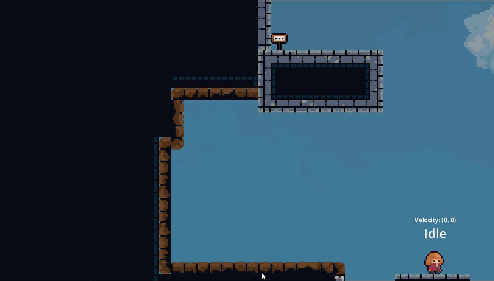

# Alys - precision platformer
This demo is based on the popular game Celeste and incorporates some of its mechanics using the [2D-Essentials](https://github.com/godotessentials/2d-essentials) plugin.

 - - -

- - -

 - - -

## Features
- A [finite state machine](https://godot-essentials.gitbook.io/addons-documentation/components/finite-state-machine) for convenient management of player states.
- States organized into sections (Ground, Air, Wall, Special) for scalability
- Implementation of movement with [GodotEssentialsMotionComponent](https://godot-essentials.gitbook.io/addons-documentation/components/godot-essentials-motion-component)
- Various states such as Idle, Run, Fall, Jump, Dash, Wall climb, Neutral, and Bounce.
- A ledge climb detector utilizing raycasting to make the character climb up when it no longer collides
- An approach to the duck technique, which allows for a slight movement adjustment when dashing straight against a wall.
- A Dash reset mechanism similar to Celeste, where you return to the previous scenario upon entering a new one

# Guide
For a comprehensive explanation of how Alys works, please refer to the [official godot 2d essentials documentation](https://godot-essentials.gitbook.io/addons-documentation/)

# Resources
- [Alys character](https://jobit91.itch.io/alys)
- [Background desert mountains](https://szadiart.itch.io/background-desert-mountains)
- [Smoke effects](https://bdragon1727.itch.io/free-smoke-fx-pixel-2)
